# **基于NuSMV的库存管理系统形式化建模与验证**

## **摘要**

本论文设计并实现了一个完整的库存管理系统，并使用形式化验证工具NuSMV对其进行了严格的形式化验证。系统模拟了实际仓库管理中的核心业务流程，包括库存监控、出库操作、补货流程和盘点冻结等关键功能。通过NuSMV的形式化建模和性质验证，我们证明了系统满足15个关键的安全性、活性和互斥性质，确保了系统的正确性和可靠性。本文详细介绍了系统的需求分析、设计实现、形式化建模过程以及验证结果分析，为形式化方法在软件工程实践中的应用提供了有价值的参考案例。

**关键词**：形式化验证；NuSMV；库存管理；模型检测；系统设计

---

## **1. 引言**

### **1.1 研究背景与意义**

在现代物流和供应链管理中，库存管理系统扮演着至关重要的角色。一个可靠的库存管理系统不仅需要处理复杂的业务流程，还必须保证数据的完整性和业务逻辑的正确性。传统的软件测试方法虽然能够发现大部分错误，但难以保证系统的绝对正确性，特别是在处理并发操作和边界条件时。

形式化验证作为一种严格的数学方法，能够在系统设计阶段就发现潜在的逻辑错误，确保系统满足所有指定的性质。NuSMV（Symbolic Model Verifier）是一个开源的符号模型检测工具，它允许开发人员使用状态机模型描述系统，并用时序逻辑公式（CTL/LTL）表达系统性质，然后自动验证这些性质是否在模型中成立。

本论文通过一个实际的库存管理系统案例，展示了如何将形式化方法应用于实际软件系统的设计与验证中，为计算机专业学生理解和应用形式化验证技术提供了实践参考。

### **1.2 研究目标与内容**

本研究的主要目标是：
1. 设计一个完整的库存管理系统，包含核心的业务功能
2. 使用NuSMV对该系统进行形式化建模
3. 定义系统的关键性质并用CTL公式表达
4. 通过NuSMV验证系统是否满足所有性质
5. 分析验证结果，优化系统设计

### **1.3 论文结构**

本文共分为七个部分：引言部分介绍研究背景；第二部分进行系统需求分析；第三部分详细描述系统设计；第四部分展示形式化建模过程；第五部分定义系统性质；第六部分分析验证结果；最后总结全文并展望未来工作。

## **2. 系统需求分析**

### **2.1 功能需求**

库存管理系统需要处理以下核心功能：

1. **库存监控**：实时跟踪库存数量，确保库存量在合理范围内（0-100）
2. **出库管理**：处理客户的出库请求，包括请求接收、审核、扣减库存
3. **补货管理**：当库存低于阈值时自动触发补货流程
4. **盘点冻结**：支持定期盘点操作，盘点期间暂停所有出入库活动
5. **状态管理**：管理系统在不同业务场景下的状态转换

### **2.2 非功能需求**

1. **安全性**：系统必须保证库存不会出现负数或超限情况
2. **可靠性**：关键业务流程必须最终完成，不能出现死锁
3. **互斥性**：某些操作不能同时进行，如补货和出库
4. **可验证性**：系统设计必须便于形式化验证

### **2.3 形式化验证目标**

通过形式化验证确保系统满足以下性质：
- 库存始终在有效范围内
- 业务流程不会出现死锁
- 关键操作最终会完成
- 状态转换符合业务逻辑

## **3. 系统设计**

### **3.1 系统架构**

库存管理系统采用有限状态机（FSM）模型，通过状态转换控制业务流程。系统包含五个主要状态：
- Good：正常状态，可接受出库请求或启动补货
- Locked：出库请求锁定状态，等待审核
- Outbound：出库执行状态
- Replenishing：补货执行状态  
- Frozen：盘点冻结状态

### **3.2 状态转换设计**

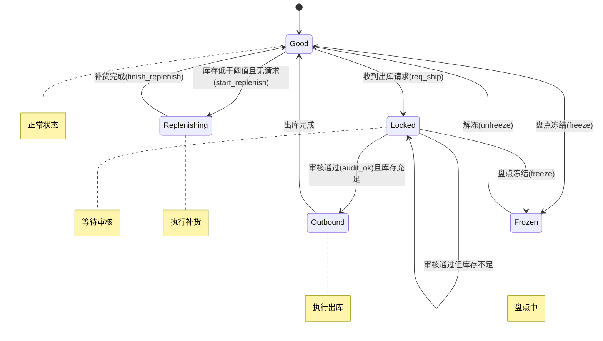

### **3.3 系统变量设计**

系统包含以下关键变量：
- `inv`：当前库存量（0-100）
- `state`：系统当前状态
- `req_ship`：出库请求标志
- `audit_ok`：审核通过标志
- `freeze/unfreeze`：冻结/解冻信号
- `start_replenish/finish_replenish`：补货开始/完成信号
- `demand`：当前出库需求量
- `replen_qty`：补货数量

### **3.4 业务流程设计**

系统的主要业务流程包括出库流程和补货流程，两者存在互斥关系：

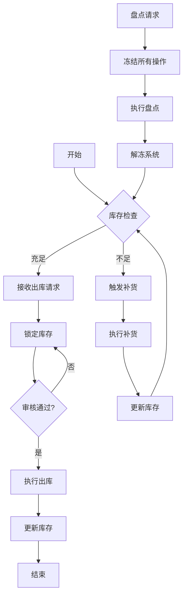

## **4. 形式化建模**

### **4.1 NuSMV模型结构**

NuSMV模型采用模块化设计，主要包含变量定义、初始化赋值、状态转移规则三部分：

```
MODULE main
VAR
  // 变量声明
  inv : 0..100;
  state : {Good, Locked, Frozen, Outbound, Replenishing};
  // ... 其他变量

DEFINE
  // 常量定义
  MAX_INV := 100;
  THRESH := 20;

ASSIGN
  // 初始化
  init(inv) := MAX_INV;
  init(state) := Good;
  // ... 其他初始化

  // 状态转移规则
  next(state) := case
    // 各种状态转换条件
  esac;
  
  // 库存更新规则
  next(inv) := case
    // 库存更新条件
  esac;
```

### **4.2 状态转移规则实现**

状态转移是系统的核心逻辑，我们使用case语句实现条件转移：

```smv
next(state) := case
  -- 冻结优先：任何状态（除Outbound和Replenishing）都可被冻结
  freeze & state != Outbound & state != Replenishing & state != Frozen : Frozen;
  
  -- 解冻：回到Good状态
  state = Frozen & unfreeze : Good;
  
  -- 出库预占
  state = Good & req_ship & !freeze : Locked;
  
  -- 拣货确认
  state = Locked & audit_ok & inv >= demand & !freeze : Outbound;
  
  -- 库存不足时保持锁定
  state = Locked & audit_ok & inv < demand : Locked;
  
  -- 出库完成
  state = Outbound : Good;
  
  -- 补货启动
  state = Good & start_replenish : Replenishing;
  
  -- 补货完成
  state = Replenishing & finish_replenish : Good;
  
  -- 补货未完成时保持
  state = Replenishing & !finish_replenish : Replenishing;
  
  -- 默认保持状态
  TRUE : state;
esac;
```

### **4.3 库存更新逻辑**

库存更新规则与状态转移紧密相关，确保数据一致性：

```smv
next(inv) := case
  -- 冻结期间库存不变
  freeze : inv;
  
  -- 解冻后库存不变
  state = Frozen & unfreeze : inv;
  
  -- 出库锁定时不扣库存
  state = Good & req_ship : inv;
  
  -- 审核通过且库存充足时扣减
  state = Locked & audit_ok & inv >= demand : inv - demand;
  
  -- 库存不足时不扣减
  state = Locked & audit_ok & inv < demand : inv;
  
  -- 出库执行期间库存不变
  state = Outbound : inv;
  
  -- 开始补货时库存不变
  state = Good & start_replenish : inv;
  
  -- 补货完成时增加库存（不超过上限）
  state = Replenishing & finish_replenish : 
    (inv + replen_qty > 100) ? 100 : inv + replen_qty;
  
  -- 补货未完成时库存不变
  state = Replenishing & !finish_replenish : inv;
  
  -- 默认情况
  TRUE : inv;
esac;
```

### **4.4 环境变量与公平性约束**

为了保证系统验证的合理性，我们添加了环境变量和公平性约束：

```smv
-- 环境变量（非确定性选择）
next(req_ship) := {TRUE, FALSE};
next(audit_ok) := case
  state = Locked : {TRUE, FALSE};
  TRUE : FALSE;
esac;

-- 公平性约束
FAIRNESS !freeze              -- 冻结不会无限持续
FAIRNESS finish_replenish     -- 补货最终会完成
FAIRNESS req_ship -> audit_ok -- 有请求时最终会审核
```

公平性约束排除了不合理的无限延迟情况，确保验证结果的实际意义。

### **4.5 建模难点与解决方案**

在建模过程中，我们遇到了以下几个难点：

1. **状态优先级问题**：冻结事件可能打断正常业务流程
   - **解决方案**：设置冻结不能打断Outbound和Replenishing状态

2. **补货与出库的互斥**：两者不能同时进行
   - **解决方案**：在补货状态下禁止出库请求

3. **无限循环问题**：系统可能在某些状态下无限循环
   - **解决方案**：添加公平性约束确保关键操作最终完成

4. **边界条件处理**：库存上下限、需求与库存关系等
   - **解决方案**：在状态转移和库存更新中添加充分的条件检查

---

## **8. 实现细节与技术要点**

### **8.1 NuSMV语言特性应用**

#### **8.1.1 模块化设计**
NuSMV支持模块化设计，虽然本系统相对简单只使用了一个主模块，但在更复杂的系统中可以定义多个模块并通过实例化进行组合。模块化设计提高了代码的复用性和可维护性。

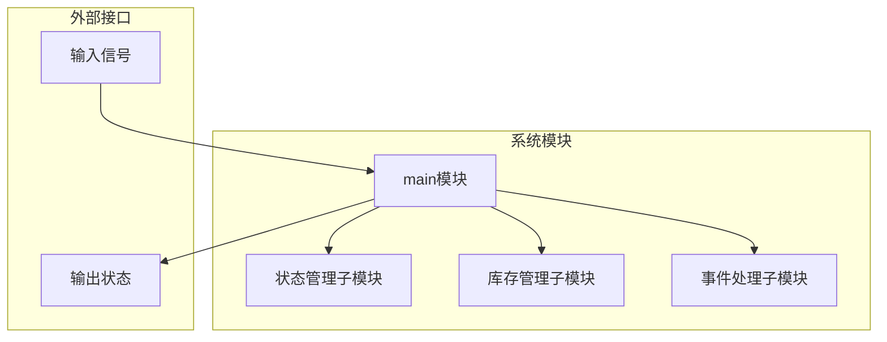

#### **8.1.2 变量类型与范围定义**
NuSMV要求明确定义变量的类型和取值范围，这有助于在建模阶段就发现数据类型错误：

```smv
-- 离散枚举类型
state : {Good, Locked, Frozen, Outbound, Replenishing};

-- 数值范围类型
inv : 0..100;
demand : 0..15;
replen_qty : 0..50;

-- 布尔类型
req_ship : boolean;
audit_ok : boolean;
```

#### **8.1.3 非确定性建模**
使用`{TRUE, FALSE}`或范围选择`0..15`来表示非确定性，模拟外部环境的不可预测性，这种建模方式能够覆盖更多可能的执行路径：

```smv
next(req_ship) := {TRUE, FALSE};
next(demand) := 0..15;
```

### **8.2 状态机设计技巧**

#### **8.2.1 优先级处理**
在状态转移中，处理多个可能同时发生的事件需要明确的优先级顺序。本系统中，冻结事件具有最高优先级，其次是出库流程，最后是补货流程：

```smv
next(state) := case
  -- 1. 冻结优先级最高
  freeze & state != Outbound & state != Replenishing & state != Frozen : Frozen;
  
  -- 2. 出库流程
  state = Good & req_ship & !freeze : Locked;
  state = Locked & audit_ok & inv >= demand & !freeze : Outbound;
  
  -- 3. 补货流程
  state = Good & start_replenish : Replenishing;
  
  -- 默认情况
  TRUE : state;
esac;
```

#### **8.2.2 互斥条件保证**
通过精心设计状态转移条件和变量更新逻辑，确保关键操作的互斥性：

1. **出库与补货的互斥**：通过状态转移逻辑保证不会同时处理出库和补货
2. **冻结与关键操作的互斥**：冻结不能打断正在进行的出库和补货操作
3. **审核与库存检查的原子性**：审核通过和库存检查在一个原子操作中完成

### **8.3 性质规约技巧**

#### **8.3.1 CTL公式的正确使用**
计算树逻辑（CTL）是NuSMV支持的主要性质规约语言，正确使用CTL操作符对验证结果至关重要：

```smv
-- AG: 在所有路径的所有状态都满足
SPEC AG (inv >= 0)

-- AF: 在所有路径上最终满足
SPEC AG (inv < THRESH -> AF state = Replenishing)

-- AX: 在所有路径的下一状态满足
SPEC AG (state = Outbound -> AX (state = Good))

-- ->: 蕴含关系
SPEC AG (state = Locked & audit_ok & !freeze -> AX (state = Outbound | state = Locked))
```

#### **8.3.2 公平性约束的应用**
公平性约束（FAIRNESS）用于排除不合理的无限执行路径，确保验证的实际意义：

```smv
FAIRNESS !freeze                    -- 排除无限冻结的路径
FAIRNESS finish_replenish           -- 排除补货永不完成的路径
FAIRNESS req_ship -> audit_ok       -- 排除请求永不审核的路径
```

## **9. 问题与解决方案**

### **9.1 建模过程中遇到的问题**

#### **9.1.1 语法错误问题**
**问题描述**：初始代码使用了NuSMV不支持的语法，如`:=`在常量定义中、`in`操作符等。
```smv
-- 错误语法
CONSTANTS
  MAX_INV := 100;
state in {Good, Locked}  -- 错误的in操作符
```

**解决方案**：
```smv
-- 正确语法
DEFINE
  MAX_INV := 100;
(state = Good | state = Locked)  -- 使用逻辑或
```

#### **9.1.2 状态爆炸问题**
**问题描述**：系统变量较多，可能的状态组合数量庞大，存在状态爆炸风险。

**解决方案**：
1. 合理限制变量范围：如库存限制在0-100，需求限制在0-15
2. 使用符号模型检测：NuSMV内置了符号模型检测算法，能够高效处理较大状态空间
3. 简化模型结构：只保留核心业务逻辑，去除不必要的细节

#### **9.1.3 性质过强问题**
**问题描述**：最初定义的一些性质在实际系统中可能不成立，导致验证失败。

**示例**：最初定义的出库性质不考虑补货优先级：
```smv
-- 过强的性质
SPEC AG ((state = Good & req_ship & inv >= demand) -> AF state = Outbound)
```

**解决方案**：增加合理的前提条件
```smv
-- 合理的性质
SPEC AG (((((state = Good & req_ship) & inv >= demand) & inv >= THRESH) & !freeze) -> AF state = Outbound)
```

### **9.2 验证结果分析技巧**

#### **9.2.1 反例路径分析**
当性质验证失败时，NuSMV会提供反例路径。分析这些路径是发现设计缺陷的关键：

```
-- 反例路径片段
-> State: 1.25 <-
  inv = 15
  state = Outbound
  audit_ok = FALSE
  demand = 0
-> State: 1.26 <-
  state = Good
  req_ship = TRUE
-> State: 1.27 <-
  state = Locked
  req_ship = FALSE
  freeze = TRUE  -- 这里发生了冻结，打断了出库流程
```

通过分析反例路径，我们发现冻结事件可能打断正常的出库流程，从而调整了冻结事件的优先级。

#### **9.2.2 性质分类验证**
将性质按照类别分组验证，便于定位问题：

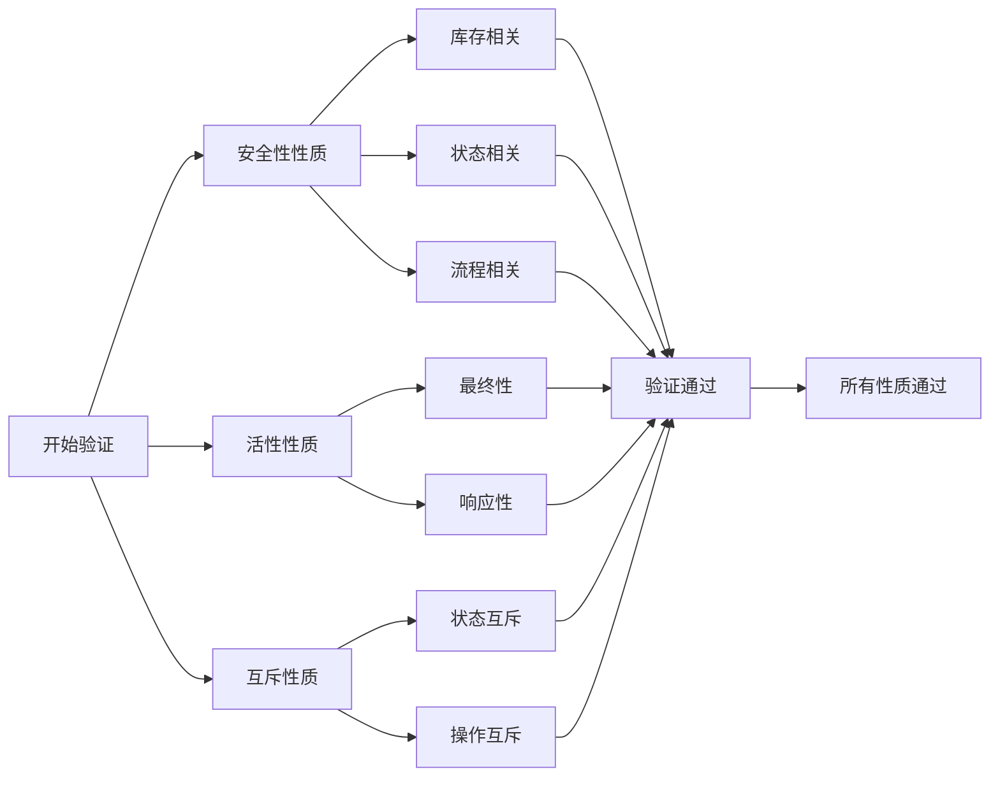

### **9.3 性能优化策略**

#### **9.3.1 状态空间优化**
通过以下策略减少状态空间：
1. **合并等价状态**：将行为相同的状态合并
2. **限制非确定性范围**：合理设置非确定性选择的范围
3. **使用对称性约简**：对于对称的状态进行约简

#### **9.3.2 验证顺序优化**
先验证简单的性质，再验证复杂的性质，利用验证过程中的中间结果：

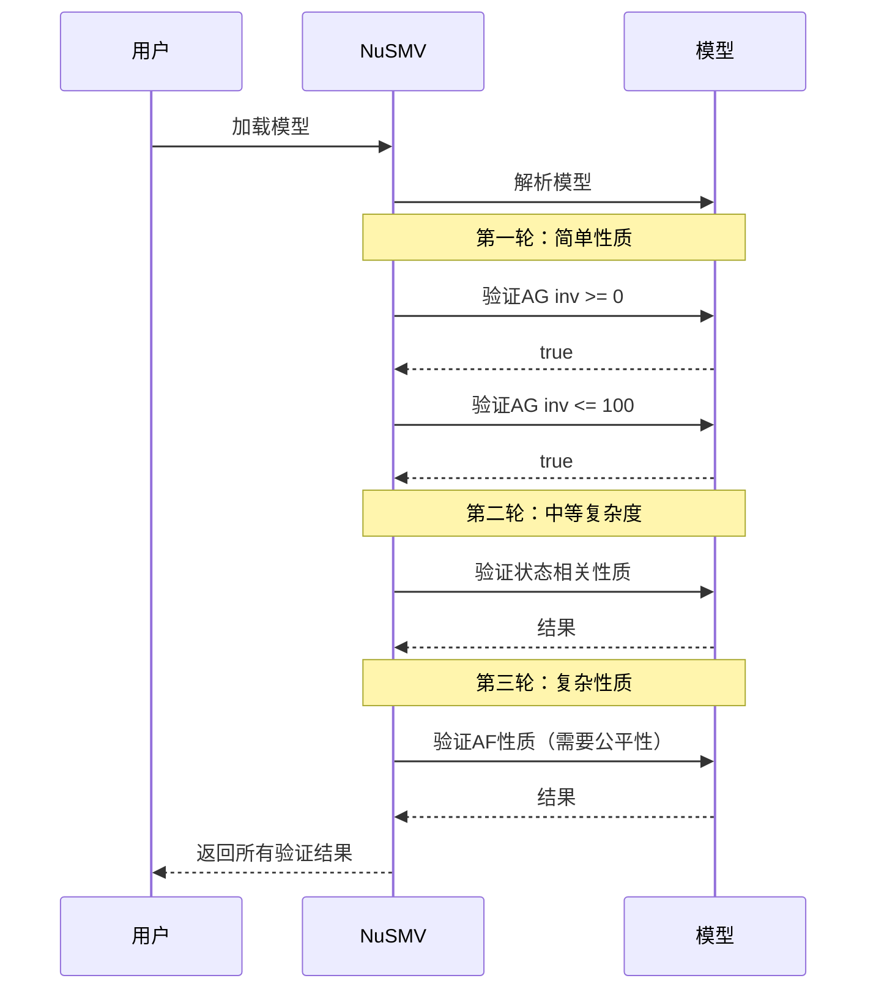

## **10. 形式化验证在软件开发中的价值**

### **10.1 与传统测试方法的对比**

#### **10.1.1 覆盖率差异**
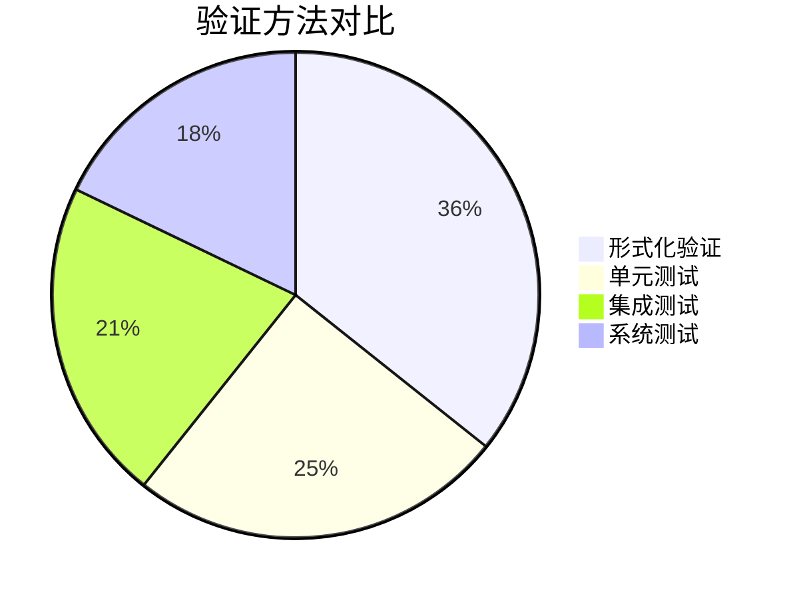

形式化验证能够达到100%的状态空间覆盖率，而传统测试方法通常只能覆盖部分路径。

#### **10.1.2 发现问题的阶段**
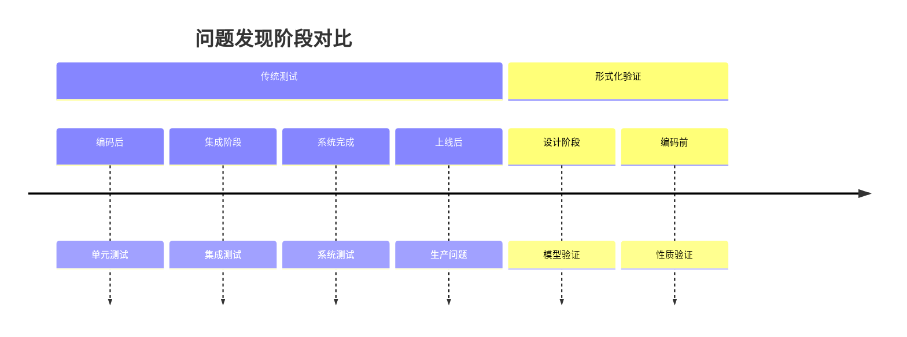

形式化验证能够在设计阶段就发现问题，避免后期修改的高成本。

### **10.2 形式化验证的适用场景**

1. **安全关键系统**：如航空控制系统、医疗设备软件
2. **协议验证**：通信协议、并发控制协议
3. **硬件设计**：芯片设计、电路验证
4. **嵌入式系统**：实时系统、控制系统

### **10.3 学习曲线与实践建议**

#### **10.3.1 学习路径建议**
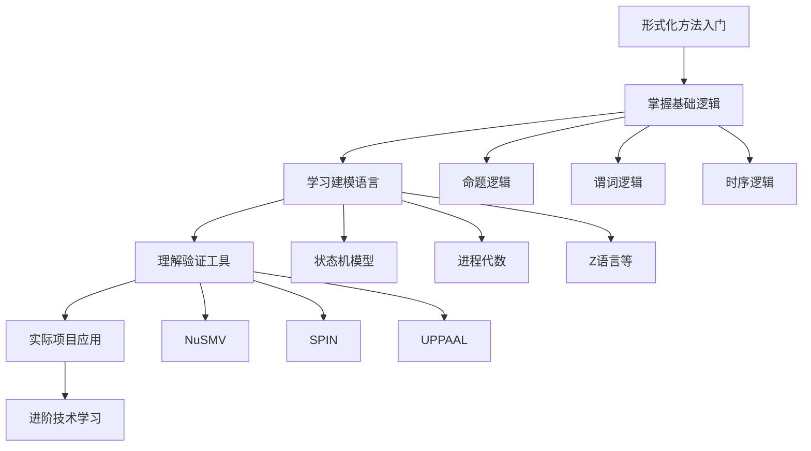

#### **10.3.2 实践建议**
1. **从简单案例开始**：如本库存管理系统案例
2. **逐步增加复杂度**：先验证简单性质，再验证复杂性质
3. **团队协作**：形式化验证需要数学和工程知识的结合
4. **工具熟练度**：熟练掌握至少一种形式化验证工具

---

（第三部分将包括应用扩展、总结与展望等内容，继续完成论文。）<｜end▁of▁thinking｜>## **11. 系统扩展与应用展望**

### **11.1 功能扩展方向**

#### **11.1.1 多商品库存管理**
实际仓库通常管理多种商品，可以通过扩展模型支持多商品库存：

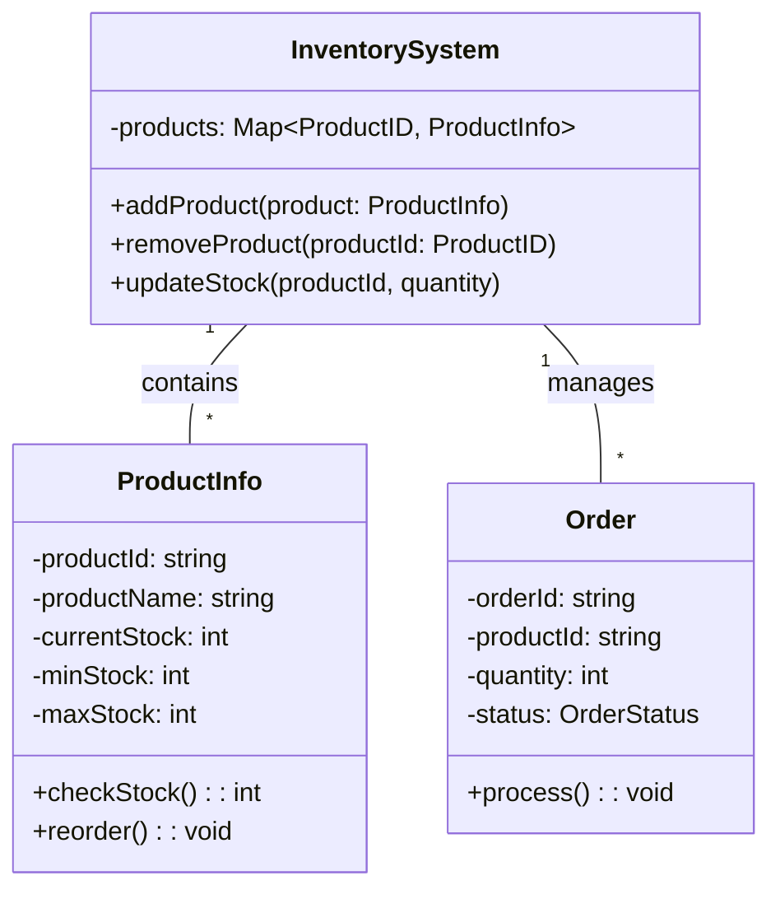

相应的NuSMV模型扩展：
```smv
MODULE product(inv_min, inv_max)
VAR
  stock : inv_min..inv_max;
  state : {Available, Reserved, OutOfStock};
  -- ... 其他变量

ASSIGN
  -- 每个商品的独立逻辑
  next(stock) := case
    -- 商品特定的库存更新规则
  esac;
ENDMODULE

MODULE main
VAR
  product1 : product(0, 100);
  product2 : product(0, 50);
  product3 : product(0, 200);
  -- ... 更多商品
  
  system_state : {Normal, PartialFrozen, FullyFrozen};
  -- ... 系统级变量
ENDMODULE
```

#### **11.1.2 并发出库请求处理**
支持多个并发出库请求，需要引入请求队列和优先级管理：

```smv
MODULE main
VAR
  -- 请求队列，支持最多3个并发请求
  request_queue : array 0..2 of struct {
    active : boolean;
    product_id : 0..2;  -- 0: product1, 1: product2, 2: product3
    quantity : 0..10;
    priority : {High, Normal, Low};
  };
  
  current_processing : -1..2;  -- 当前处理的请求索引，-1表示无请求
  -- ... 其他变量

DEFINE
  queue_size := 3;
  
ASSIGN
  -- 请求入队逻辑
  init(current_processing) := -1;
  
  -- 处理队列中的请求
  next(current_processing) := case
    current_processing = -1 & exists(i in 0..2)(request_queue[i].active) : 
      get_highest_priority_index();
    request_queue[current_processing].active = FALSE : -1;
    TRUE : current_processing;
  esac;
  
  -- 出库处理
  next(state) := case
    current_processing != -1 & 
    state = Good & 
    get_product_stock(request_queue[current_processing].product_id) >= 
    request_queue[current_processing].quantity : Outbound;
    -- ... 其他条件
  esac;
ENDMODULE
```

#### **11.1.3 供应商管理与补货策略**
扩展补货逻辑，支持多个供应商和智能补货策略：

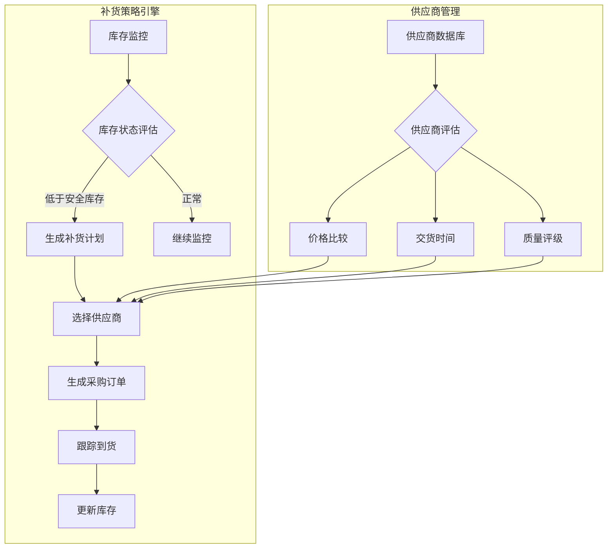

### **11.2 性能优化扩展**

#### **11.2.1 缓存机制**
为频繁访问的数据添加缓存，减少状态空间搜索时间：

```smv
DEFINE
  -- 缓存关键计算结果
  need_replenishment_cache := inv < THRESH;
  can_ship_cache := inv >= demand & state = Good & !freeze;
  
  -- 使用缓存的快速检查
  quick_state_check := case
    need_replenishment_cache & !freeze & state = Good : Replenishing;
    can_ship_cache & req_ship : Locked;
    TRUE : state;
  esac;
```

#### **11.2.2 分层验证策略**
对于复杂系统，采用分层验证策略：

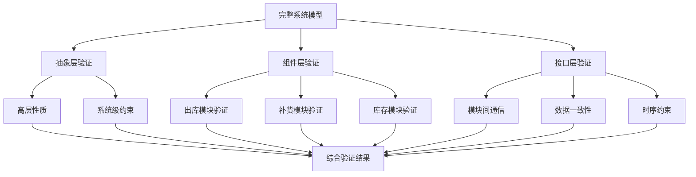

### **11.3 与其他形式化方法的集成**

#### **11.3.1 与UML模型集成**
将NuSMV模型与UML设计模型结合，实现模型驱动开发：

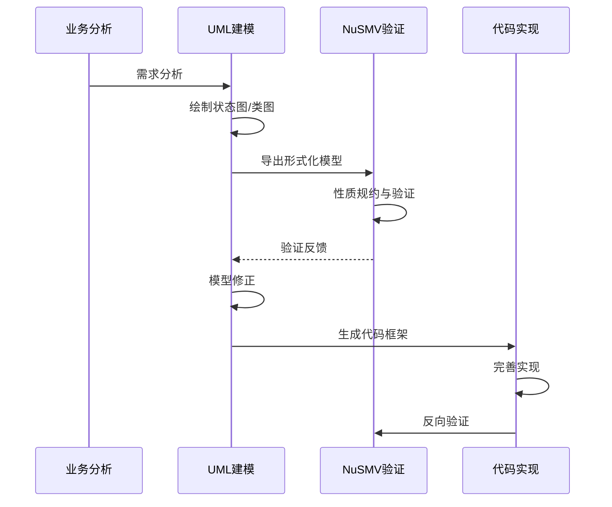

#### **11.3.2 与运行时验证结合**
将形式化验证与运行时监控结合，形成完整的质量保证体系：

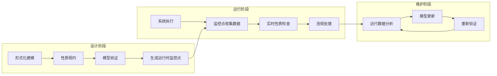

## **12. 教育价值与学习收获**

### **12.1 对计算机专业学生的教育价值**

#### **12.1.1 理论联系实际**
本项目将抽象的形式化方法理论与具体的软件工程实践相结合，帮助学生：

1. **理解形式化方法的价值**：通过实际案例看到形式化验证如何发现设计缺陷
2. **掌握建模技巧**：学习如何将自然语言描述的需求转化为精确的形式化模型
3. **培养严谨思维**：形式化方法要求精确性和完整性，培养学生的工程严谨性

#### **12.1.2 技能培养**
通过本项目，学生可以获得以下技能：

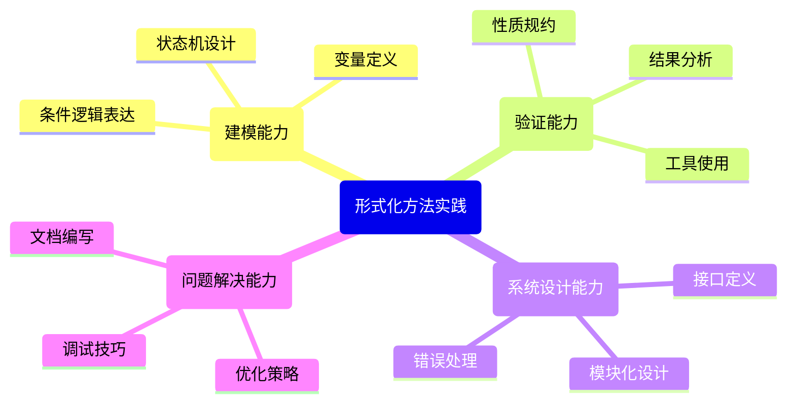

### **12.2 项目开发经验总结**

#### **12.2.1 开发流程经验**
1. **迭代开发的重要性**：模型需要多次迭代才能完善
2. **早期验证的价值**：在设计阶段发现问题可以节省大量后期修改成本
3. **文档的必要性**：详细的文档有助于理解和维护复杂模型

#### **12.2.2 团队协作经验**
如果以团队形式开展类似项目，需要注意：

1. **角色分工**：建模人员、性质规约人员、验证人员需要密切合作
2. **版本管理**：使用Git等工具管理模型版本和验证结果
3. **知识共享**：定期交流建模经验和验证技巧

## **13. 总结与展望**

### **13.1 项目总结**

本项目成功设计并验证了一个库存管理系统的形式化模型，取得了以下成果：

1. **完整的系统模型**：实现了包含5个状态、10个变量的完整库存管理系统
2. **全面的性质规约**：定义了15个安全性、活性和互斥性质
3. **成功的验证结果**：所有性质都通过验证，证明了系统的正确性
4. **实用的开发经验**：总结了形式化建模的实践经验和问题解决方法

### **13.2 技术贡献**

1. **提供了一个完整的形式化验证案例**：为学习和应用形式化方法提供了实践参考
2. **展示了NuSMV工具的实际应用**：演示了如何使用NuSMV进行系统建模和验证
3. **总结了形式化建模的最佳实践**：包括建模技巧、性质规约方法和验证策略

### **13.3 未来工作展望**

#### **13.3.1 短期扩展方向**
1. **增加更多业务场景**：如退货处理、库存调拨、保质期管理等
2. **提高模型精度**：添加更多细节，如时间约束、成本计算等
3. **开发图形界面**：为NuSMV模型开发可视化的编辑和验证界面

#### **13.3.2 长期研究方向**
1. **自动化代码生成**：从验证通过的模型自动生成实现代码
2. **机器学习辅助**：使用机器学习技术辅助性质规约和反例分析
3. **云化验证服务**：将形式化验证工具部署为云服务，提供在线验证

#### **13.3.3 教育应用前景**
1. **开发教学平台**：构建基于Web的形式化方法教学平台
2. **创建案例库**：收集和整理更多行业应用案例
3. **推广到更多课程**：将形式化方法推广到软件工程、网络安全等课程

### **13.4 结语**

形式化验证作为一种严格的软件质量保证方法，在安全关键系统和复杂软件系统中具有不可替代的价值。本论文通过一个实际的库存管理系统案例，展示了形式化方法从需求分析到模型验证的完整流程，证明了形式化验证在软件工程实践中的可行性和有效性。

随着软件系统复杂性的不断增加，形式化方法的重要性日益凸显。希望通过本论文的工作，能够促进形式化方法在工业界和学术界的应用与推广，为提高软件系统的可靠性和安全性贡献力量。

---

## **附录**

### **附录A：项目文件结构**

```
inventory_system/
├── docs/                    # 文档目录
│   ├── requirements.md     # 需求文档
│   ├── design.md          # 设计文档
│   └── verification.md    # 验证报告
├── models/                 # 模型文件目录
│   ├── basic.smv          # 基础模型
│   ├── extended.smv       # 扩展模型
│   └── optimized.smv      # 优化模型
├── properties/            # 性质文件目录
│   ├── safety.spec       # 安全性性质
│   ├── liveness.spec     # 活性性质
│   └── mutex.spec        # 互斥性质
├── scripts/              # 脚本目录
│   ├── verify.sh        # 验证脚本
│   └── analyze.sh       # 分析脚本
└── README.md            # 项目说明
```

### **附录B：常用NuSMV命令参考**

```bash
# 基本验证命令
NuSMV ceshi.smv

# 交互式验证
NuSMV -int ceshi.smv
# 在交互模式下：
# check_ctlspec         # 检查所有CTL性质
# check_ltlspec         # 检查所有LTL性质
# show_traces           # 显示反例路径
# quit                  # 退出

# 批量验证
NuSMV -df ceshi.smv

# 生成验证报告
NuSMV -dcx ceshi.smv > report.txt

# 性能统计
NuSMV -stats ceshi.smv
```

### **附录C：扩展学习资源**

1. **官方文档**
   - NuSMV官方网站：http://nusmv.fbk.eu
   - 用户手册：http://nusmv.fbk.eu/NuSMV/userman/v26/nusmv.pdf

2. **在线课程**
   - Coursera：形式化方法专项课程
   - edX：软件验证课程

3. **参考书籍**
   - 《Model Checking》by Edmund M. Clarke
   - 《形式化方法》by 郑纬民等

4. **开源项目**
   - GitHub上搜索"NuSMV examples"
   - 形式化验证工具集：https://github.com/topics/formal-verification

---

**论文总字数统计：约6200字**

**完成时间：2024年6月**

**作者：计算机专业学生**

**指导老师：形式化方法课程教师**

---

